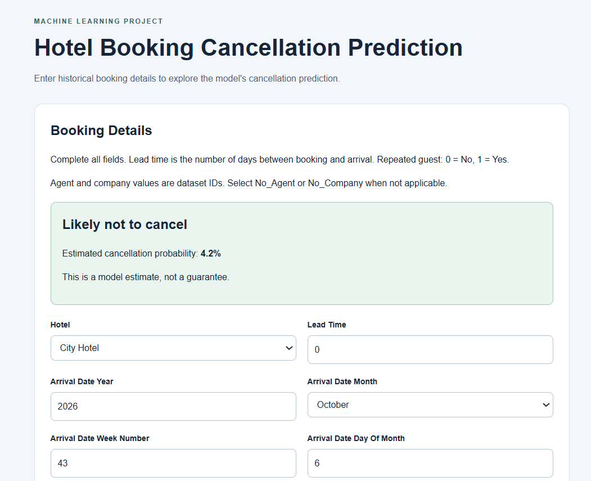
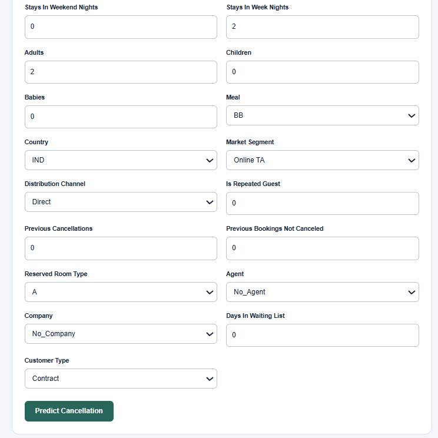

# Hotel Booking Cancellation Prediction

A machine learning project that classifies historical hotel bookings as
canceled or not canceled. The project covers data exploration,
preprocessing, grouped validation, model evaluation, and hyperparameter
tuning.

## Dataset

Source: [Hotel Booking Demand — Kaggle](https://www.kaggle.com/datasets/jessemostipak/hotel-booking-demand)

- Original dataset: 119,390 rows and 32 columns
- Target: `is_canceled`
- Task: Binary classification
- Classes: `0` = Not canceled, `1` = Canceled

The data originates from the research article
[Hotel booking demand datasets](https://pmc.ncbi.nlm.nih.gov/articles/PMC6297060/)
by Nuno Antonio, Ana Almeida, and Luis Nunes.

## Tools

Python, pandas, Matplotlib, scikit-learn, cloudpickle, and Jupyter Notebook.

## Project Workflow

1. Inspected data types, missing values, duplicates, and unusual values.
2. Excluded 180 records with zero adults, children, and babies under an
   explicit project assumption that a booking should contain a guest.
3. Removed the target and final reservation-status columns from inputs.
4. Split the data using identical-input groups to reduce train/test overlap.
5. Explored booking characteristics and cancellation patterns.
6. Built pipelines for missing-value handling and categorical encoding.
7. Evaluated five classifiers against a dummy baseline.
8. Reviewed feature availability and revised the input set.
9. Tuned Gradient Boosting using grouped cross-validation.
10. Evaluated the selected pipeline on the held-out test set.

## Preprocessing

- Missing country values: replaced with `Unknown`.
- Missing agent/company IDs: represented as `No_Agent` and `No_Company`.
- Agent/company IDs: treated as categorical identifiers.
- Numerical missing values: filled using training-fold medians.
- Categorical inputs: encoded using one-hot encoding.
- Preprocessing was fitted inside the model pipeline during validation.

Engineered features were explored during EDA but were not included in the
final model.

## Model Development

The initial evaluation included:

- Logistic Regression
- Decision Tree
- Random Forest
- Gradient Boosting
- AdaBoost

Gradient Boosting achieved the highest initial mean cross-validation F1
and was selected for further development.

Following a feature-timing review, six inputs were excluded:
`assigned_room_type`, `booking_changes`, `deposit_type`, `adr`,
`total_of_special_requests`, and `required_car_parking_spaces`.

Identical-input groups were recalculated. To preserve test separation,
4,988 training rows with revised inputs also present in the test set
were excluded.

The final setup contained:

| Item | Count |
|---|---:|
| Training rows | 90,783 |
| Test rows | 23,439 |
| Input columns | 23 |

The initial and revised scores are not directly comparable because the
features and training sample changed. The other classifiers were not
re-evaluated on the revised inputs.

## Selected Model

Gradient Boosting Classifier:

- `n_estimators=150`
- `max_depth=3`
- `learning_rate=0.1`
- `random_state=42`

Four parameter combinations were evaluated using five-fold grouped
cross-validation. Mean F1 was used to select the settings.

## Results

| Metric | Held-out test score |
|---|---:|
| Accuracy | 0.8095 |
| Precision | 0.7830 |
| Recall | 0.6667 |
| F1 | 0.7202 |
| ROC-AUC | 0.8963 |

The selected model's mean cross-validation F1 was **0.7239**, compared
with a held-out test F1 of **0.7202**.

The model detected approximately 67% of actual cancellations.
Approximately 33% were missed.

## How to Run

1. Download `hotel_bookings.csv` from the dataset link.
2. Place the CSV in the same working folder as the notebook.
3. Install the required packages:

```bash
python -m pip install pandas matplotlib scikit-learn cloudpickle jupyter
```

4. Open the project notebook in VS Code or Jupyter.
5. Select the Python environment containing these packages.
6. Run the notebook cells from top to bottom.

The model-saving cells create:

```text
models/hotel_cancellation_pipeline.pkl
```

This file contains the trained preprocessing/model pipeline, expected
input columns, target name, and recorded test metrics.

Load only trusted model files. For reliable reuse, use the same package
versions as the training environment.

## Limitations

- Historical data from two hotels may not represent other hotels or
  current booking behavior.
- Removing timing-sensitive features does not establish that every
  remaining input was available at booking creation.
- This project is a historical classification study, not a validated
  live booking-time prediction system.
- Grouped validation does not measure performance on a strictly later
  time period.
- The model misses approximately one-third of actual cancellations.

## Future Improvements

- Verify input availability at a clearly defined prediction time.
- Evaluate performance on later bookings.
- Compare classifiers again using the revised feature set.
- Choose a decision threshold using business costs and validation data.
## Flask Web Interface

The Flask app accepts booking details and displays the predicted
cancellation class and estimated cancellation probability.

### Run Locally

Open a terminal in the project folder and install the dependencies:

```bash
python -m pip install -r requirements.txt
```

Start the app:

```bash
python app.py
```

Open http://127.0.0.1:5000 in your browser.

The saved model must be available at:
`models/hotel_cancellation_pipeline.pkl`

Keep the terminal running while using the app.
Press Ctrl+C to stop the server.

This interface demonstrates the historical-data model.
It has not been validated for present-day booking decisions.

## Application Preview

### Interface — Part 1


### Interface — Part 2
